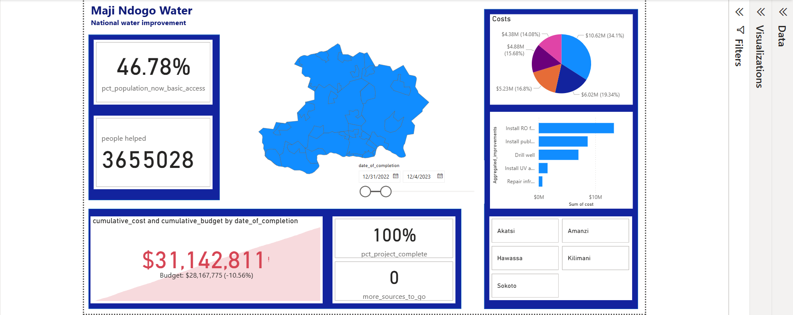
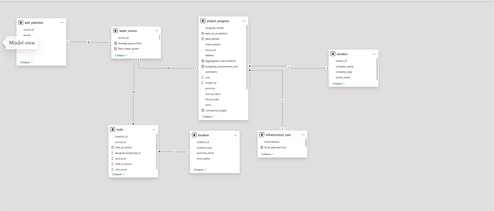
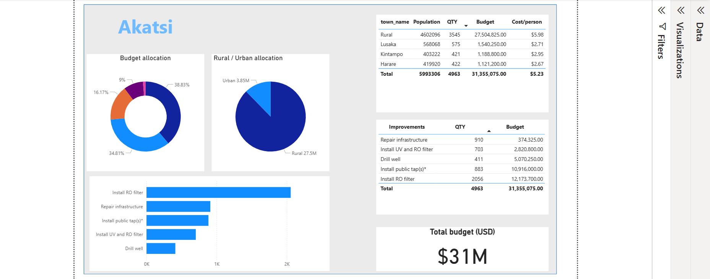
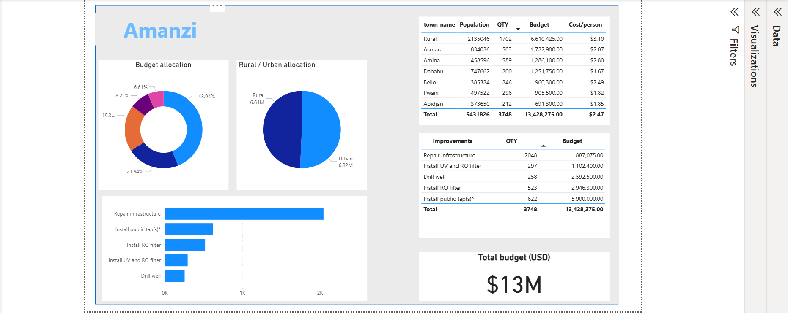
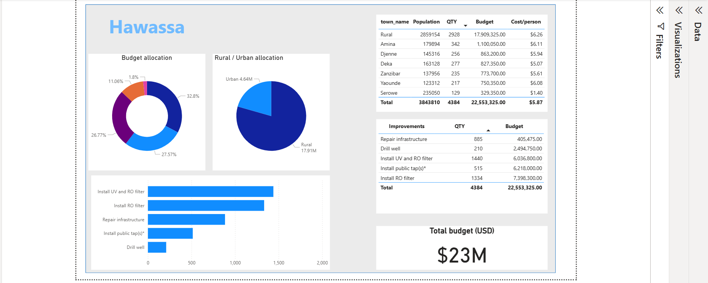
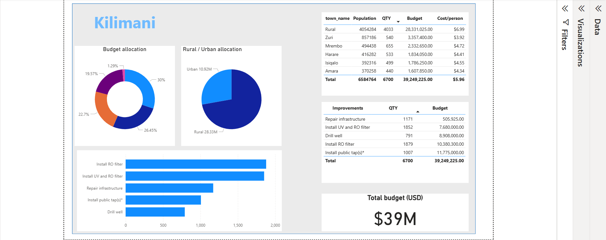
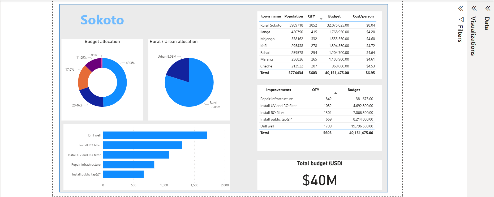

# Visualising the Currents of Change in Maji Ndogo

An advanced data analytics and visualization project developed using **Power BI** to investigate and communicate the water crisis in Maji Ndogo. This project focuses on gender disparities, resource management, and transparency in infrastructure funding.

## 📊 Project Overview
This project transforms raw data into an interactive visual narrative to assist stakeholders and the community. Over a four-week analytical journey, the project evolved from data cleaning and relational modeling to the creation of high-impact, transparent dashboards.

### Key Objectives:
* **Identify Gender Disparities:** Highlighting the time spent and risks faced by women and children at communal water points.
* **Infrastructure Analysis:** Monitoring the progress and efficiency of water tap installations and repairs across various regions.
* **Transparency & Accountability:** Tracking budgets against actual costs to identify potential corruption and ensure funds reach their intended projects.

---

## 🛠️ Technical Implementation

### Data Modeling & Transformation
* **Relational Modeling:** Sculpted a robust data model to connect disparate datasets including surveys, water source logs, and budget reports.
* **DAX (Data Analysis Expressions):** Developed complex measures and calculated columns to quantify performance, calculate budget variances, and aggregate regional data.
* **Power Query:** Performed extensive data cleaning and transformation to ensure accuracy in visualization.

### Dashboards & Insights
The project features several focused reporting layers:
1.  **Maji Ndogo Executive Overview:** A high-level summary of the water crisis impact across the nation.
2.  **Regional Spotlights:** Dedicated views for specific provinces to identify localized infrastructure needs.
3.  **Transparency Tracker:** A specialized dashboard for monitoring total budget vs. actual completion, designed to promote accountability.

---

## 📸 Visual Gallery

### Core Project Views
| National Overview | Relational Model |
| :---: | :---: |
|  |  |

### Regional Breakdowns
| Akatsi Overview | Amanzi Overview |
| :---: | :---: |
|  |  |

| Hawassa Overview | Kilimani Overview |
| :---: | :---: |
|  |  |

| Sokoto Overview |
| :---: |
|  |

---

## 🚀 How to Use
1.  **Requirement:** You must have [Power BI Desktop](https://powerbi.microsoft.com/desktop/) installed.
2.  **Clone the Repository:**
    ```bash
    git clone [https://github.com/Fredrick-Maina-Mburu/MajiNdogo.git]
    ```
3.  **Open the Project:** Launch `MajiNdogo.pbix` to explore the interactive visualizations, slicers, and cross-visual filtering.

## 💡 Skills Demonstrated
* **Data Storytelling:** Translating analytical findings into actionable community insights.
* **UI/UX Design:** Applying design principles to create intuitive and impactful reports.
* **Business Intelligence:** Using filters, slicers, and cross-visual interactions to drive decision-making.

---
